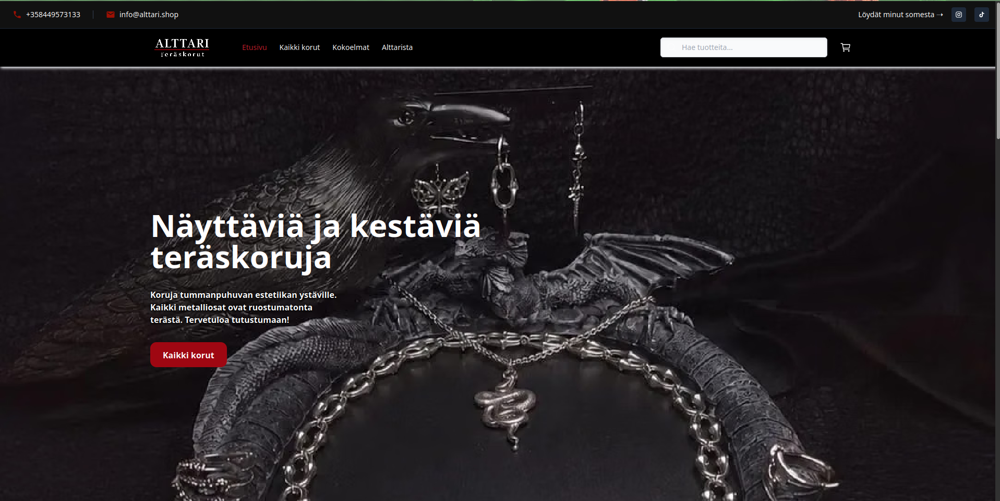

# Alttari E-Commerce Frontend

The decoupled frontend application for Alttari, built with Nuxt 3 and connected to a headless WordPress/WooCommerce backend via WPGraphQL.

## Architecture & Stack

* **Frontend:** Nuxt 3 / Vue.js
* **Backend:** Headless WooCommerce (WPGraphQL)
* **Hosting / CI-CD:** Netlify (`netlify.toml` handles build config)
* **Styling:** Native CSS (`main.css`) & Vue Scoped Styles (`<style scoped>`). Utility-first frameworks (like Tailwind/UnoCSS) are intentionally excluded to maintain strict component-level encapsulation.

## Environment Variables

The application requires the following environment variable to connect to the backend, which must be present in a local `.env` file and configured in the Netlify dashboard:

* `GQL_HOST` - The GraphQL endpoint for the WordPress backend (e.g., `https://[backend-domain]/graphql`)

## 🛠 Development Commands

Project uses `npm` and `package-lock.json`.

* **Install dependencies:** `npm install`
* **Start development server:** `npm run dev`
* **Build for production:** `npm run build`
* **Generate static site:** `npm run generate`